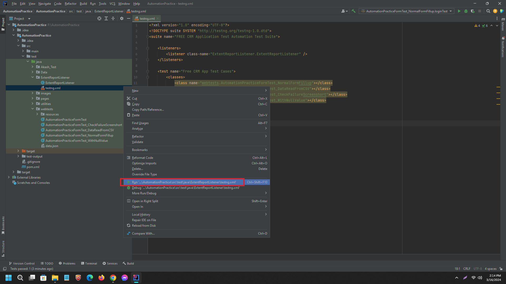
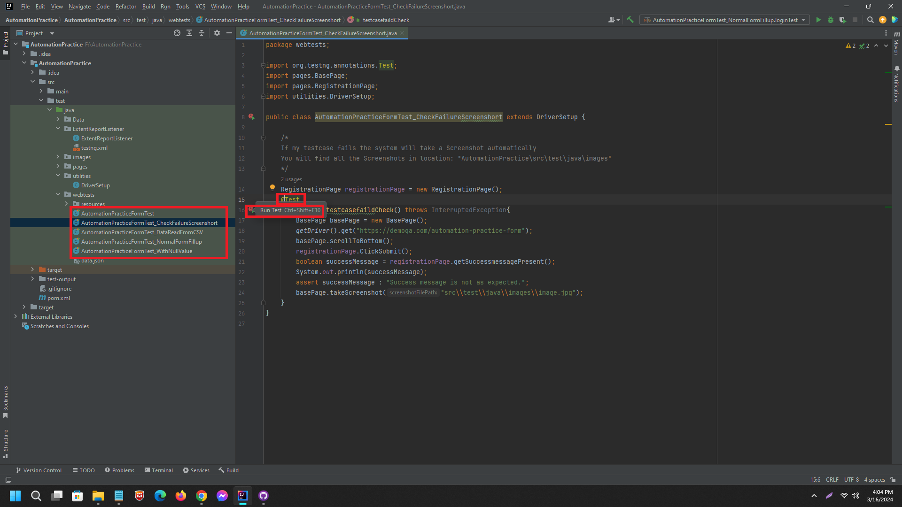

# Automation Practice Form Test

This project contains automated tests for the "Student Registration Form" on the Automation Practice website. Various functionalities of the form have been automated to ensure comprehensive test coverage.

## Implemented Test Cases

1. **Normal Flow Test**: Fill up the form in a normal flow and verify the success message.
2. **CSV Data Testing**: Test the form with different datasets from a CSV file.
3. **Null Value Testing**: Test the form with datasets containing null values.

## Features Implemented

1. **Screenshots**: Screenshots are taken for successful form submissions and for any failures during automation. Images are stored in the `AutomationPractice\src\test\java\images` folder.

2. **CSV File Support**: Multiple data sets can be run using a CSV file. The CSV file is located in the `AutomationPractice\src\test\java\Data` folder.

3. **HTML Report**: An HTML report is generated for the test execution. The report can be found in the `AutomationPractice\test-output` folder.

4. **Browser Responsiveness Testing**: Responsiveness of the application across different browsers and devices is tested. This feature is implemented in the `DriverSetup.java` file under `AutomationPractice\src\test\java\utilities` folder. You can change the browser under the `setBrowser()` method.

## Instructions

1. Ensure all dependencies are installed by running `mvn clean install`.
2. Run the tests by executing the TestNG XML file `testng.xml`.
3. View the HTML report generated in the `AutomationPractice\test-output` folder after test execution.
4. Review the screenshots stored in the `AutomationPractice\src\test\java\images` folder for any visual verification.
5. Explore and modify the test cases in the `AutomationPractice\src\test\java\webtests` folder to add or customize functionalities.

## Dependencies

- Java
- Maven
- TestNG
- Selenium WebDriver
- OpenCSV

## Clone

git clone https://github.com/Akash-Ahmed-CSE/your-repository.git
cd your-repository


## Instructions on How to Run It

1. Clone the repository:
    ```bash
    git clone https://github.com/Akash-Ahmed-CSE/AutomationPractice.git
    cd AutomationPractice
    ```

2. Ensure you have all the necessary dependencies installed, including Java, TestNG, and any other libraries required for the project.

3. Open the project in the ide and run the following files under "webtests" folder or run the test suite present in the AutomationPractice\src\test\java\ExtentReportListener\testng.xml file.
### Test Suite in testng.xml file

### Run Individual Test


5. After running the tests, you can find the HTML report in the `test-output` directory.

6. Additionally, you can run individual test files by executing specific test classes or methods using your preferred IDE or TestNG commands.

